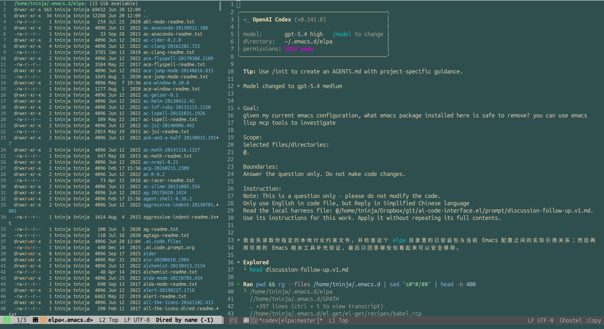

* Why AI Coding Agents + Emacs MCP Tools Are Great for Package Cleanup

 I used an AI coding agent + Emacs MCP tools to clean up my Emacs packages (hundreds of them in last 10+ years), and the useful part was not "AI knows Emacs."

The key was that the agent could do both file inspection and live Emacs inspection:

- scan config for `require`, `use-package`, and load-path usage

- query Emacs runtime state directly

- compare installed packages with what is actually active

That makes it much easier to separate packages that are merely installed from packages that are still referenced or really in use.

For package cleanup, that is the difference between guessing and knowing.

That is where an AI agent helps a lot: it can inspect the config and give you a ranked cleanup list instead of guesses.

I used Codex CLI + emacs mcp tools with this package. I believe https://github.com/manzaltu/claude-code-ide.el can do the same thing. 
